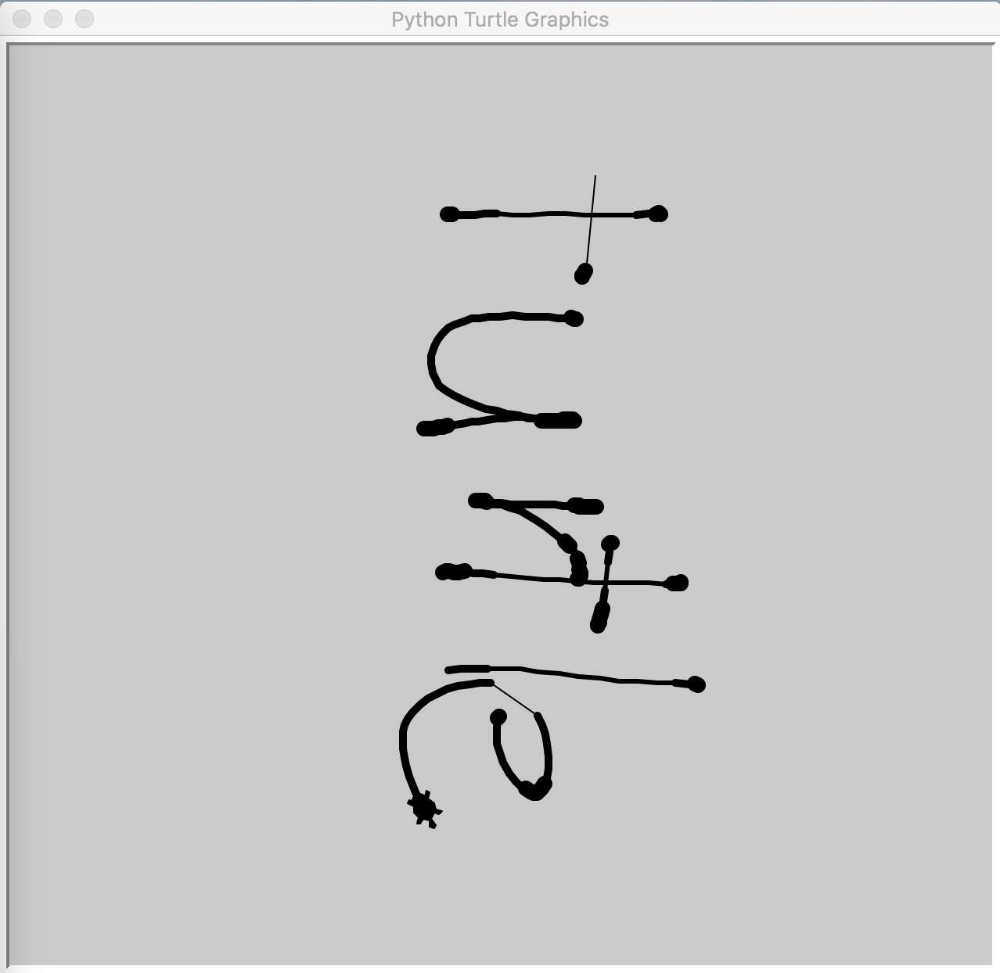

# turtle
## Description
turtleを使ったお絵かきツール

## Demo
* 表示画面


* 入力画面


## Requirement
* Python (3.5.x or later)
* [websockets](https://websockets.readthedocs.io/en/stable/index.html)

## Usage
* server

```
python server.py
```
* client

```
python -m http.server 8080
```
